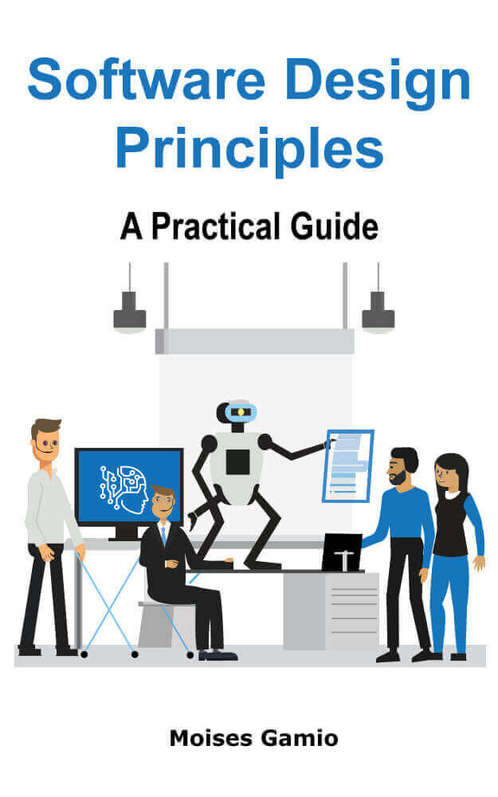

  
  

    
I was born in Lima, Peru, where I studied for 5 years and obtained a degree in System Engineering. I have been working 20 years as a Software Engineer for several companies from different economic sectors such as Government, Financial, Industrial, Educative, Consulting, Retail, and Research.

    

    <h4>A little more...</h4>

    
I have been programming in several languages such as Java, C, Cobol, C#, Visual Basic, PHP, Prolog, Python, PL/SQL and JScript. My tasks have been related to Software Development, stages of Analysis, Design, Testing, and Deployment.

    
During 8 years, I worked as a System Analyst for the Bank Sector. Since 2014, I am working as a Software Engineer in a B2B company in Berlin, Germany.

    
This is my blog site to share my knowledge and experience in everyday situations that we, as developers, face daily. At the moment, I am passionate about the following things:

    <ul>
      <li>Clean Code</li>
      <li>Spring Framework</li>
      <li>RESTful Web Services</li>
      <li>Automated testing</li>
      <li>Software Design</li>
      <li>Software Architecture</li>
      <li>Distributed Systems</li>
      <li>Data Structure and Algorithms</li>
	  <li>Object-Oriented Programming</li>
      <li>Learning new technologies</li>
    </ul>
	
  

  

    

      
	  <h5>Buy me a coffee</h5>

      
Thank you for your support! Your donation helps me to maintain and improve codersite.

      <form action="https://www.paypal.com/donate" method="post" target="_top">
        <input type="hidden" name="hosted_button_id" value="UF4T364RTPPMJ" />
        <input type="image" src="https://www.paypalobjects.com/en_US/DK/i/btn/btn_donateCC_LG.gif" border="0" name="submit" title="PayPal - The safer, easier way to pay online!" alt="Donate with PayPal button" />
        
      </form>

       

      
This practical guide aims to make you a better software designer within the object-oriented paradigm.

      
      
	  
<a target="_blank" href="https://amzn.to/3AucVBA" class="btn btn-danger">EUR 5.00</a>

	  
       

	  
A fun t-shirt for every front-end, backend or developers who loves programming.

      
      
	  
<a target="_blank" href="https://codercuy.creator-spring.com/listing/hello-world-2189?product=389&variation=100029&size=3002" class="btn btn-danger">I want this!</a>

    

  

 

Follow me on: 

[][1]{:target="_blank"}
[][2]{:target="_blank"}
[][3]{:target="_blank"}
[][4]{:target="_blank"}

[1]: https://medium.com/@mkgv89
[2]: http://www.twitter.com/MoisesGamio
[3]: https://github.com/mgamio
[4]: https://www.facebook.com/codersite.dev