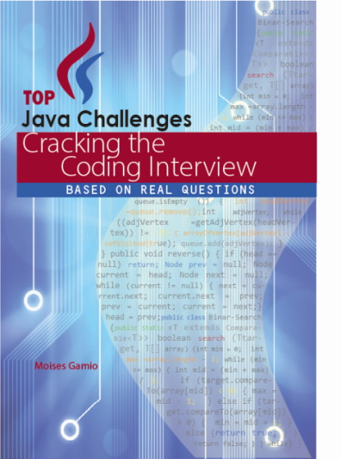
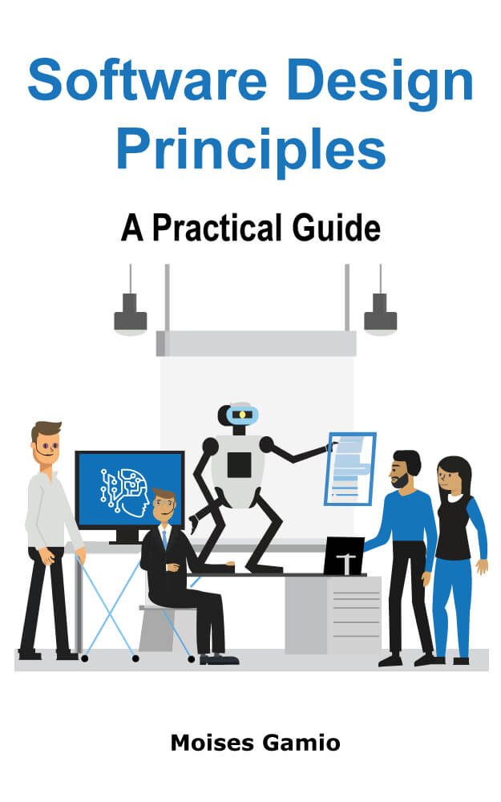

  
  

    
I was born in Lima, Peru, where I studied for 5 years and obtained a degree in System Engineering. I have been working 20 years as a Software Engineer for several companies from different economic sectors such as Government, Financial, Industrial, Educative, Consulting, Retail, and Research.

    

    <h4>A little more...</h4>

    
I have been programming in several languages such as Java, C, Cobol, C#, Visual Basic, PHP, Prolog, Python, PL/SQL and JScript. My tasks have been related to Software Development, stages of Analysis, Design, Testing, and Deployment in On-premise and Cloud computing environments.

    
During 8 years, I worked as a System Analyst for the Bank Sector. Since 2014, I am working as a Software Engineer in a B2B company in Berlin, Germany.

    
This is my blog site to share my knowledge and experience in everyday situations that we, as developers, face daily. At the moment, I am passionate about the following things:

    <ul>
      <li>Clean Code</li>
      <li>Spring Framework</li>
      <li>RESTful Web Services</li>
      <li>Automated testing</li>
      <li>Software Design</li>
      <li>Software Architecture</li>
      <li>Distributed Systems</li>
      <li>Data Structure and Algorithms</li>
	  <li>Object-Oriented Programming</li>
	  <li>Cloud Computing</li>
      <li>Learning new technologies</li>
    </ul>
	
	Please support me as a writer. Every contribution helps, and your donation can help add more articles to this website, no matter how small. Thank you!
	 
	
	<iframe
    src="https://www.paypal.com/giving/campaigns?campaign_id=SR3NH5R4FNH8Q"
    title="PayPal donate campaign card"
    frameborder="0"
    width=382
    height=550
    scrolling="no"></iframe>

  

  

    

      

      
Master Data Structures & Algorithms — And Ace Your Coding Interviews

	  
<a target="_blank" href="https://amzn.to/4r5w9FR" class="btn btn-danger">I want this</a>

       
	  
      

      
Stop losing interviews because you can’t master algorithms: learn to solve problems like top engineers do.

	  
<a target="_blank" href="https://amzn.to/3Pppk2z" class="btn btn-danger">I want this</a>

       

      

      
Real-world examples, diagrams, and explanations that make complex systems simple.

	  
<a target="_blank" href="https://amzn.to/3AucVBA" class="btn btn-danger">I want this</a>

    

  

 

Follow me on: 

[][1]{:target="_blank"}
[][2]{:target="_blank"}
[][3]{:target="_blank"}
[][4]{:target="_blank"}

[1]: https://medium.com/@mkgv89
[2]: http://www.twitter.com/MoisesGamio
[3]: https://github.com/mgamio
[4]: https://www.facebook.com/codersite.dev